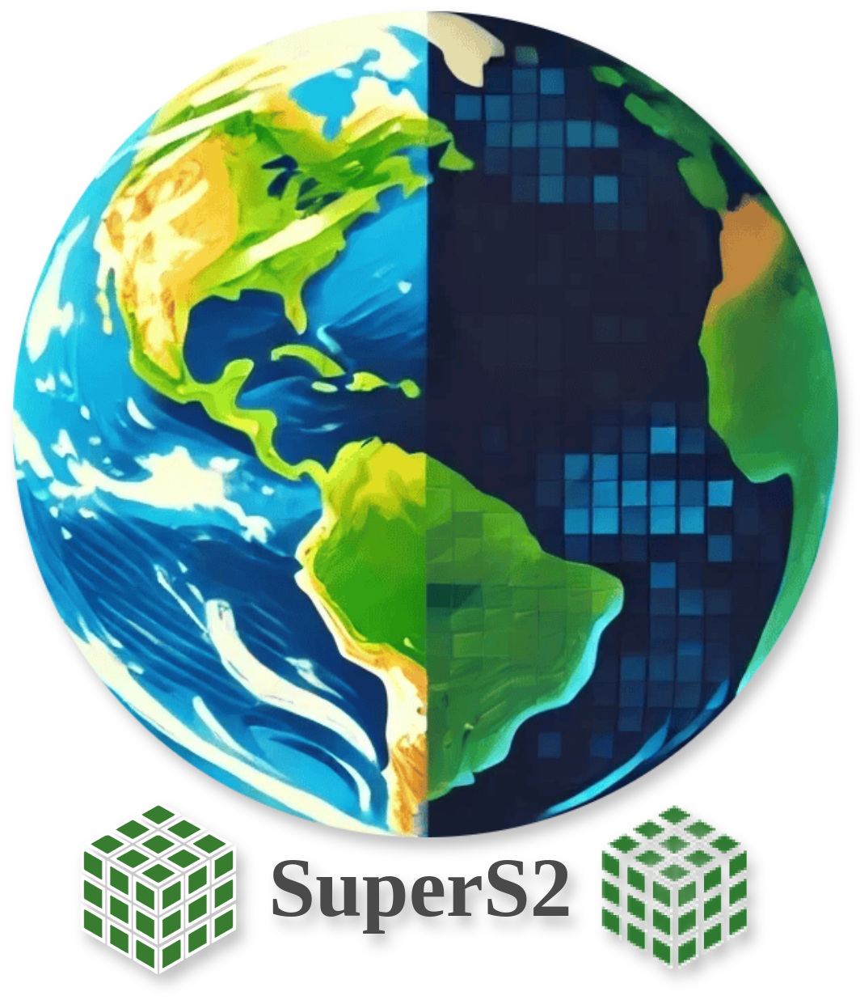
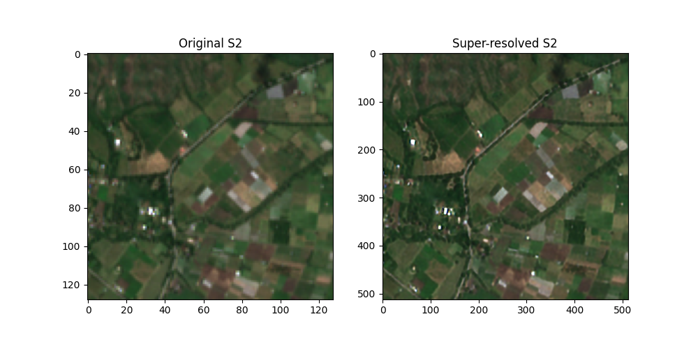

# 

<p align="center">
  
</p>

<p align="center">
   <em>A Python package for enhancing the spatial resolution of Sentinel-2 satellite images up to 2.5 meters</em> 🚀
</p>


<p align="center">
<a href='https://pypi.python.org/pypi/supers2'>
    
</a>
<a href="https://opensource.org/licenses/MIT" target="_blank">
    
</a>
<a href="https://github.com/psf/black" target="_blank">
    
</a>
<a href="https://pycqa.github.io/isort/" target="_blank">
    
</a>
<a href="https://colab.research.google.com/drive/1TD014aY145q1reKN644egUtIM6tIx9vH?usp=sharing" target="_blank">
    
</a>
</p>


---

**GitHub**: [https://github.com/IPL-UV/supers2](https://github.com/IPL-UV/supers2) 🌐

**PyPI**: [https://pypi.org/project/supers2/](https://pypi.org/project/supers2/) 🛠️

---

## **Overview** 📊

**supers2** is a Python package designed to enhance the spatial resolution of Sentinel-2 satellite images to 2.5 meters using a set of neural network models. 

## **Installation** ⚙️

Install the latest version from PyPI:

```bash
pip install supers2
```

## **How to use** 🛠️

### **Basic usage: enhancing spatial resolution of Sentinel-2 images** 🌍

```python
import matplotlib.pyplot as plt
import numpy as np
import supers2
import torch
import cubo

## Download Sentinel-2 L2A cube
da = cubo.create(
    lat=4.31, 
    lon=-76.2, 
    collection="sentinel-2-l2a", 
    bands=["B02", "B03", "B04", "B05", "B06", "B07", "B08", "B8A", "B11", "B12"], 
    start_date="2021-06-01", 
    end_date="2021-10-10", 
    edge_size=128, 
    resolution=10
)

# Convert the data array to NumPy and scale
original_s2_numpy = (da[11].compute().to_numpy() / 10_000).astype("float32")

# Check if CUDA is available, use GPU if possible, otherwise fallback to CPU
device = torch.device("cuda" if torch.cuda.is_available() else "cpu")

# Create the tensor and move it to the appropriate device (CPU or GPU)
X = torch.from_numpy(original_s2_numpy).float().to(device)

# Set up the model to enhance the spatial resolution
models = supers2.setmodel(device=device)

# Apply spatial resolution enhancement
superX = supers2.predict(X, models=models, resolution="2.5m")

# Visualize the results
# Plot the original and enhanced-resolution images
fig, ax = plt.subplots(1, 2, figsize=(10, 5))
ax[0].imshow(X[[2, 1, 0]].permute(1, 2, 0).cpu().numpy()*4)
ax[0].set_title("Original S2")
ax[1].imshow(superX[[2, 1, 0]].permute(1, 2, 0).cpu().numpy()*4)
ax[1].set_title("Enhanced Resolution S2")
plt.show()
```

<p align="center">
  
</p>


## Chante the model settings 🛠️

At the end of the document, you can find a table with the available models and their characteristics.

```python
# Set up the model to enhance the spatial resolution
models = supers2.setmodel(
    resolution = "2.5m", # Set the desired resolution
    sr_model_snippet = "sr__opensrbaseline__cnn__medium__l1", # RGBN model from 10m to 2.5m
    fusionx2_model_snippet = "fusionx2__opensrbaseline__cnn__large__l1", # RedESWIR model from 20m to 10m
    fusionx4_model_snippet = "fusionx4__opensrbaseline__cnn__large__l1", #RedESWIR model from 10m to 2.5m
    weights_path = None, # Path to the weights file
    device = "cpu" # Use the CPU
)

# Apply spatial resolution enhancement
superX = supers2.predict(X, models=models, resolution="2.5m")
```

### **Predict only RGBNIR bands** 🌍

```python
superX = supers2.predict_rgbnir(X[[2, 1, 0, 6]])
```

### **Estimate the uncertainty of the model** 📊

```python
from supers2.trained_models import SRmodels

# Get the available models
models = list(SRmodels.model_dump()["object"].keys())

# Get only swin transformer models
swin2sr_models = [model for model in models if "swin" in model]

map_mean, map_std = supers2.uncertainty(
    X[[2, 1, 0, 6]],
    models=swin2sr_models
)

# Visualize the uncertainty
fig, ax = plt.subplots(1, 2, figsize=(10, 5))
ax[0].imshow(mean_map[0:3].cpu().numpy().transpose(1, 2, 0)*3)
ax[0].set_title("Mean")
ax[1].imshow(std_map[0:3].cpu().numpy().transpose(1, 2, 0)*100)
ax[1].set_title("Standard Deviation")
plt.show()
```


### Estimate the Local Attention Map of the model 📊


```python
kde_map, complexity_metric, robustness_metric, robustness_vector = supers2.lam(
    X=X[[2, 1, 0, 6]].cpu(), # The input tensor
    model=models.srx4, # The SR model
    h=240, # The height of the window
    w=240, # The width of the window
    window=128, # The window size
    scales = ["1x", "2x", "3x", "4x", "5x", "6x", "7x", "8x"]
)

# Visualize the results
plt.imshow(kde_map)
plt.title("Kernel Density Estimation")
plt.show()

plt.plot(robustness_vector)
plt.title("Robustness Vector")
plt.show()
```


### Use the opensr-test and supers2 to analyze the hallucination pixels 📊
